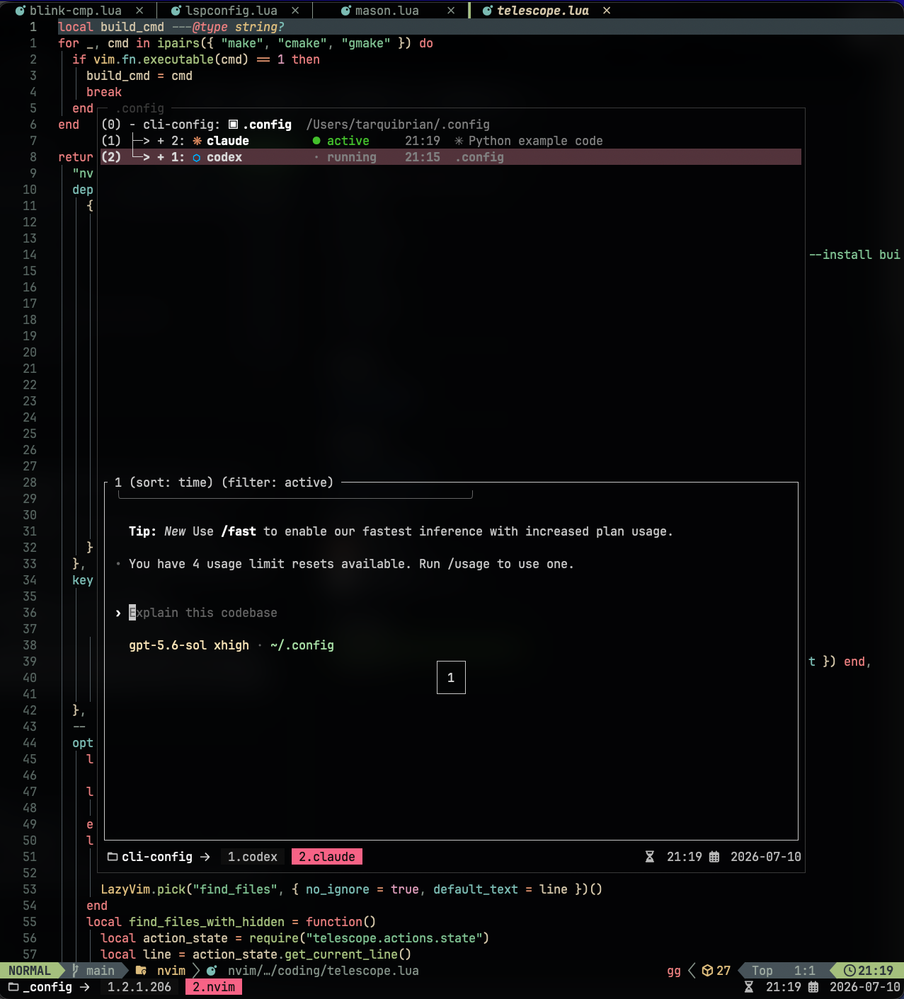
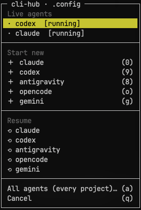

# tmux-cli-hub

A lightweight popup hub for AI CLI agents in tmux. Launch Claude Code, Codex,
Gemini, opencode, or any CLI-based agent in a persistent, per-project tmux
session, shown as a popup.


- **Persistent** — each project gets its own tmux session; close the popup,
  the agent keeps running in the background as a normal tmux session.
- **Configurable** — pick your own keybindings and CLI commands per agent,
  add new agents by adding a config line, no forking required.
- **Zero dependencies** — pure tmux + POSIX sh. No Node, no daemon, no
  protocol adapter.
- **Multi-project** — one keypress reopens the right session for whatever
  project you're currently in.

This is the lite counterpart to
[tmux-acp-hub](https://github.com/tarquibrian/tmux-acp-hub): acp-hub
runs agents through the Agent Client Protocol behind a persistent Node
daemon (rich rendering, true status, saved transcripts). tmux-cli-hub instead
just runs the agent's own CLI directly inside a tmux session — no protocol,
no daemon, works with anything you can run from a terminal.

## Requirements

| Need | Version / note |
|------|-----------------|
| tmux | >= 3.2 (uses `display-popup`; popup titles need >= 3.3, auto-skipped below that) |
| sh | POSIX sh (dash, bash, or zsh's sh mode) |
| `md5sum` or `md5` | for project-path hashing — standard on macOS/Linux |

Each configured CLI is invoked directly — install and authenticate it
however you normally would; it just needs to be on `PATH`.

## Installation

With [TPM](https://github.com/tmux-plugins/tpm), add to `~/.tmux.conf`:

```tmux
set -g @plugin 'tarquibrian/tmux-cli-hub'
```

Then prefix + <kbd>I</kbd> to install.

Manual:

```sh
git clone https://github.com/tarquibrian/tmux-cli-hub ~/.config/tmux/plugins/tmux-cli-hub
```

```tmux
run '~/.config/tmux/plugins/tmux-cli-hub/cli-hub.tmux'
```

## Keybindings

Default (prefix + key):

| Key | Action |
|-----|--------|
| `0` | Open/create the Claude Code popup |
| `9` | Open/create the Codex popup |
| `8` | Open/create the Antigravity popup |
| `o` | Open/create the opencode popup |
| `g` | Open/create the Gemini popup |
| `)` | Claude Code, auto-approve mode |
| `(` | Codex, auto-approve mode |
| `*` | Antigravity, auto-approve mode |
| `m` | Toggle — hide the popup / return to it. With no popup yet for this project, opens the `M` overlay so you can start one |
| `M` | Agent overlay — one bottom-left menu grouped into Live agents / Start new / Resume, per provider |
| `s` | Inside a popup: an expanded window tree of your agents (provider icon · status · last activity · the CLI's own title) — pick one to switch to, staying in the popup. Outside: normal work-session chooser (agent-hub sessions filtered out) |
| `y` | Agent menu — every running agent across every project, same rich rows |
| `X` | Close menu — close this agent, kill a project's agents, or prune dead ones |

**Security note:** `)`, `(`, and `*` launch the agent with its permission
prompts disabled (`--dangerously-skip-permissions` /
`--dangerously-bypass-approvals-and-sandbox`). In that mode the agent can run
commands and edit files without asking first. Only use these keys in
projects and environments you trust.

## Configuring agents

Each agent is one tmux option, read in order starting at `@cli_hub_agent_1`:

```
@cli_hub_agent_N = "name:key:command[:autokey:autocommand]"
```

- `name` — label shown in the menu/status.
- `key` — prefix-key that opens/creates this agent's popup.
- `command` — the CLI command to run.
- `autokey` / `autocommand` *(optional)* — a second key bound to the same
  agent in its auto-approve/yolo mode.

Defaults:

```tmux
set -g @cli_hub_agent_1 "claude:0:claude:):claude --dangerously-skip-permissions"
set -g @cli_hub_agent_2 "codex:9:codex:(:codex --dangerously-bypass-approvals-and-sandbox"
set -g @cli_hub_agent_3 "antigravity:8:agy:*:agy --dangerously-skip-permissions"
set -g @cli_hub_agent_4 "opencode:o:opencode"
set -g @cli_hub_agent_5 "gemini:g:gemini"
```

To customize, set these **before** the plugin's `run` line in `tmux.conf`:

```tmux
# Reorder / remap a default
set -g @cli_hub_agent_1 "codex:9:codex"

# Add a new agent — any CLI works
set -g @cli_hub_agent_6 "aider:a:aider --yes"

# Disable a default slot
set -g @cli_hub_agent_4 ""
```

Slots are scanned `1..@cli_hub_agent_max_slots` (default `20` — raise it if
you need more than 20 agents). Gaps are fine: disabling slot 4 doesn't stop
slot 5 from loading.

## How it works

- Each project gets a dedicated tmux session named `<prefix>-<project>`
  (`@cli_hub_session_prefix`, default `agents`; e.g. `agents-myapp`). The
  project is the git root of the current directory, or the directory itself
  if it isn't a git repo. If two different projects share a basename, the
  second gets a short path-hash suffix (`agents-myapp-9f72`) so each project
  still maps to one stable session.
- Opening an agent creates a window in that session — or reuses it if
  already running — and shows it via `display-popup`. Closing the popup
  (`m`) doesn't kill the agent; it keeps running, detached, until you reopen
  or close it (`X`).
- The agent menu (`y`) lists every window across every `<prefix>-*` session
  with a colored glyph and a best-effort status:
  - `dead` ✗ / `exited` ⊘ — **high confidence.** The pane process is gone, or
    the CLI quit and the window dropped to a shell prompt (detected via
    `pane_current_command`, so it's language-independent).
  - `needs-input` ▲ — the pane title mentions a permission/approval prompt.
    Opportunistic: only fires if the CLI sets such a title.
  - `active` ● — produced output within `@cli_hub_active_secs` (default 10s).
  - `running` · — alive, nothing else known.

  This is a heuristic, not a protocol: there's no guarantee a CLI's title or
  output timing reflects its true state. The strong signals (`dead`,
  `exited`) are reliable for any CLI; the rest are hints. For real,
  protocol-backed status use [tmux-acp-hub](https://github.com/tarquibrian/tmux-acp-hub).

`prefix + s` inside a popup shows the same rows as an expanded tree — provider
icon, status, last activity, the CLI's own title — with tmux's live preview of
the selected agent:



## The agent overlay (`prefix + M`) and history

`M` opens one native menu for the current project:

- **Live agents** — the running agents in this project; pick one to jump to it.
- **New `<provider>`** — launch a fresh agent, same as its open key.
- **Resume `<provider>`** — launch the CLI in its own resume mode.



cli-hub keeps **no history of its own** — it's an external launcher, and each
CLI already stores and resumes its own past sessions. "Resume" just runs the
provider's native resume command (`@cli_hub_resume_<provider>`) in a
`<name>-resume` window, and the CLI shows its own picker. So a unified,
cross-provider transcript list (like acp-hub's `prefix + M`) isn't possible
here — that needs a daemon and a protocol. What cli-hub gives you is one place
to reach every provider's live agents and native resume.

Built-in resume defaults (override or set to `""` to hide the entry):

```tmux
set -g @cli_hub_resume_claude      "claude --resume"       # session picker
set -g @cli_hub_resume_codex       "codex resume"          # session picker
set -g @cli_hub_resume_antigravity "agy --continue"        # most recent
set -g @cli_hub_resume_opencode    "opencode --continue"   # last session
set -g @cli_hub_resume_gemini      "gemini --resume latest"
```

The provider name is derived from the agent (`claude`, `codex`, `antigravity`,
`opencode`, `gemini`); a custom agent with no matching `@cli_hub_resume_*`
simply gets no Resume entry.

## Configuration (tmux options)

| Option | Default | Meaning |
|--------|---------|---------|
| `@cli_hub_session_prefix` | `agents` | Prefix for the per-project tmux sessions (letters/digits/`_`/`-` only) |
| `@cli_hub_hash_length` | `8` | Hash length used for project hashing / collision suffixes |
| `@cli_hub_popup_width` | `80%` | Popup width |
| `@cli_hub_popup_height` | `80%` | Popup height |
| `@cli_hub_active_secs` | `10` | Output within this many seconds marks an agent `active` |
| `@cli_hub_agent_max_slots` | `20` | How many `@cli_hub_agent_N` slots to scan |
| `@cli_hub_resume_<provider>` | per provider | Resume command used by the `M` overlay (`""` hides the entry) |

## tmux-resurrect / continuum

cli-hub keeps no state of its own — each agent's history lives in its own CLI
(reach it again with `M` → Resume) — so there's nothing here for
[resurrect](https://github.com/tmux-plugins/tmux-resurrect) to save. But
resurrect saves *every* session, agent sessions included, and on restore they
come back as hollow shells: the agent process isn't relaunched (it's not in
`@resurrect-processes`) and the `@cli_hub_*` metadata isn't saved, so you get
empty skeleton sessions. If you use resurrect/continuum auto-save, exclude the
agent sessions from the save with the bundled hook:

```tmux
set -g @resurrect-hook-post-save-all 'sh ~/.config/tmux/plugins/tmux-cli-hub/scripts/resurrect-exclude.sh'
```

It strips `cli-*` / `agents-*` (and a sibling acp-hub's `acp-*` / `vz-*`) from
each save, so a restore never resurrects a dead agent. Real history is
untouched — it was never in resurrect to begin with.

## Tests

```sh
tests/smoke.sh
```

Drives every script against a throwaway tmux server (its own socket — your
real server is never touched): session naming and collisions, the status
heuristic, the close/prune lifecycle, menu construction, quoting of hostile
paths, and the resurrect filter. Exit 0 = all checks passed.

## Uninstall

Remove the `run` line from `tmux.conf`. Agent sessions aren't killed
automatically — use the `X` close menu ("kill this project" / "prune dead"),
or list them with `tmux ls` and kill what you don't need with
`tmux kill-session -t <prefix>-<project>`.

## License

MIT
